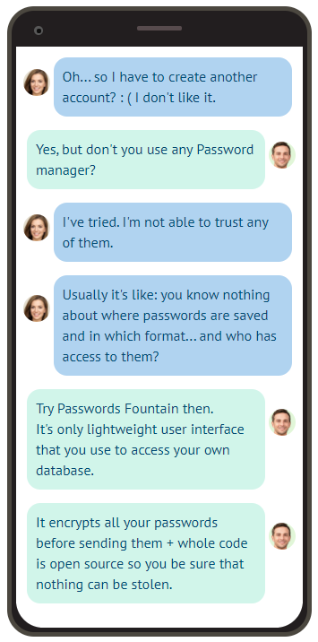

 
 

    

 

# Passwords Fountain

Modern & performant password manager **interface** which works everywhere :iphone: :computer: :tv:

**Passwords Fountain is completely free and lightweight UI.**
Start your journey\* at https://www.passwords-fountain.com

\*Note: _To start, you don't have to host / own anything but your browser_

    

## Sounds great! How to start?

There is **5-step** mini guide on our Homepage, check it out:
https://www.passwords-fountain.com

If you feel that you need additional help to setup the app, don't hestitate to contact with the author: https://twitter.com/kolodziejczakMn

### Is it safe?

#### We do our best to make it safe:

1. We **don't store any vulnerable data** - your passwords neither land on localStorage, sessionStorage, IndexedDB nor any server.
2. Passwords Fountain has access to your database as long as you want to.
   You can remove admin key from your database account anytime (**it's you who are in control!**).
3. In your database (https://fauna.com/) passwords are stored in encrypted version so nobody can steal them from there.
4. We use strict [Content-Security-Policy](https://content-security-policy.com/) to **prevent any third party script** from being injected during runtime.
5. We don't use any tracking / logging tool like: Google Analytics, LogRocket or Sentry.

#### What you can do to make it safe:

1. Don't give your FaunaDB admin key\* to anybody. If somebody intercepts it they may be able to delete your passwords or add anything to your database.
2. Be careful when decrypting your passwords in public - they may be noticed by people around you.

\*_FaunaDB admin key_ is a database token needed to establish connection between [FaunaDB](https://fauna.com/) (database) and Passwords fountain (user interface).

#### What can make you feel safe?

1. You can always check in what way Passwords Fountain works via putting "random" data into it - you don't risk anything. Again - it's the best to start from our **5-step** mini guide which you can find [here](https://www.passwords-fountain.com).
2. If you're a programmer - you can even go through application code to ensure that your privacy is not violated.
   If you still don't feel save, then maybe try running your own instance?

### Can I run my own instance?

Of course! If you don't want to use official Passwords Fountain instance from https://www.passwords-fountain.com, you can fork the code, use any ([free?](https://dev.to/0xbanana/easy-and-free-ways-to-publish-a-website-in-2020-44lo)) static site hosting service and you are all set!

Using "public" instance is preferred though - we can polish it together. It can be hard to help with bug fixing on your private, modified instance.

### Why there is no privacy policy and cookie consent?

We don't store any data that would require such an action.

There is language preference stored in LocalStorage and encrypted admin key needed to establish connection between FaunaDB (database) and Passwords fountain (user interface).
That's all.

### I found a bug. What should I do?

Don't hesitate to open an issue! If you're new on github, read this [guide](https://help.github.com/en/github/managing-your-work-on-github/creating-an-issue).

### I opened an issue, but I also want to help in closing them. Can I?

Of course! Contribution flow looks like this:

1. Fork this repo
2. Create your feature branch (`git checkout -b new-feature`) on your fork.
3. Write the code.
4. Write tests!
5. Commit your changes via `npm run commit` - we use commitizen to ensure that all commits will have appropriate structure.
6. Push to your origin branch via `npm run push` - this will bump code version in `package.json` and `package-lock.json` files, update `CHANGELOG.md` and create git tag.
7. Create new pull request (from `your_fork_repository/new-feature` to this repository master branch).
8. Wait for code review and react accordingly, thanks a lot!

### Contact

Don't hestitate to ask questions I'm always willing to help - https://twitter.com/kolodziejczakMn
